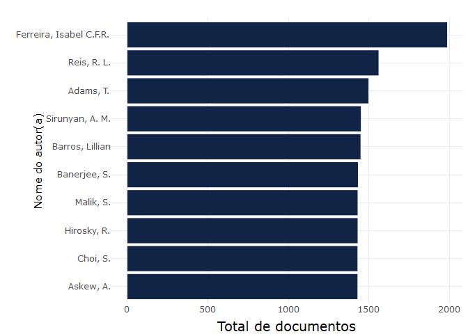

## Indicadores gerais oasisbr

Os indicadores da oasisbr são disponibilizados via api.

``` r
oasisbrAPILink <- "https://oasisbr.ibict.br/vufind/api/v1/search?&type=AllFields&page=0&limit=0&sort=relevance&facet[]=author_facet&facet[]=dc.subject.por.fl_str_mv&facet[]=eu_rights_str_mv&facet[]=dc.publisher.program.fl_str_mv&facet[]=dc.subject.cnpq.fl_str_mv&facet[]=publishDate&facet[]=language&facet[]=format&facet[]=institution&facet[]=dc.contributor.advisor1.fl_str_mv"
```

É feito o download do arquivo em formato `JSON` via pacote `jsolinte`,
utilizando-se a função `fromJSON`.

``` r
library(jsonlite)
oasisbrDF <- fromJSON(oasisbrAPILink)
```

------------------------------------------------------------------------

O arquivo possui a seguinte estrutura:

``` r
names(oasisbrDF)
```

    ## [1] "resultCount" "facets"      "status"

------------------------------------------------------------------------

Dentro da lista `resultCount`, encontra-se **quantidade de documentos**
recuperados:

``` r
oasisbrDF$resultCount
```

    ## [1] 2735632

------------------------------------------------------------------------

Dentro da lista `facets`, encontram-se **dez listas para dez variáveis
diferentes**:

``` r
names(oasisbrDF$facets)
```

    ##  [1] "author_facet"                      "dc.subject.por.fl_str_mv"         
    ##  [3] "eu_rights_str_mv"                  "dc.publisher.program.fl_str_mv"   
    ##  [5] "dc.subject.cnpq.fl_str_mv"         "publishDate"                      
    ##  [7] "language"                          "format"                           
    ##  [9] "institution"                       "dc.contributor.advisor1.fl_str_mv"

Todas as listas possuem **4 colunas** (exemplo: `author_facet`):

``` r
names(oasisbrDF$facets$author_facet)
```

    ## [1] "value"      "translated" "count"      "href"

A coluna `value` representa o valor, `translated` o valor traduzido,
`count` a frequência e `href` o hyperlink.

``` r
head(oasisbrDF$facets$author_facet)
```

    ##                             value                      translated count
    ## 1         Ferreira, Isabel C.F.R.         Ferreira, Isabel C.F.R.  1974
    ## 2                     Reis, R. L.                     Reis, R. L.  1545
    ## 3                 Barros, Lillian                 Barros, Lillian  1430
    ## 4                 Teixeira, J. A.                 Teixeira, J. A.  1400
    ## 5                 Sirunyan, A. M.                 Sirunyan, A. M.  1187
    ## 6 Instituto de Engenharia Nuclear Instituto de Engenharia Nuclear  1102
    ##                                                                                        href
    ## 1       ?limit=0&type=AllFields&filter%5B%5D=author_facet%3A%22Ferreira%2C+Isabel+C.F.R.%22
    ## 2                   ?limit=0&type=AllFields&filter%5B%5D=author_facet%3A%22Reis%2C+R.+L.%22
    ## 3               ?limit=0&type=AllFields&filter%5B%5D=author_facet%3A%22Barros%2C+Lillian%22
    ## 4               ?limit=0&type=AllFields&filter%5B%5D=author_facet%3A%22Teixeira%2C+J.+A.%22
    ## 5               ?limit=0&type=AllFields&filter%5B%5D=author_facet%3A%22Sirunyan%2C+A.+M.%22
    ## 6 ?limit=0&type=AllFields&filter%5B%5D=author_facet%3A%22Instituto+de+Engenharia+Nuclear%22

------------------------------------------------------------------------

Dentro da lista `status`, é exiba uma mensagem sobre o **status** do
`JSON`.

``` r
oasisbrDF$status
```

    ## [1] "OK"

------------------------------------------------------------------------

# Visualização dos indicadores

## Autor `author_facet`

``` r
library(ggplot2)
library(scales)
library(plotly)

author_facet <- oasisbrDF$facets$author_facet

## Ordena coluna 'count'
author_facet <- author_facet[with(author_facet, order(-count)),]

## Retira registro 'sem informação' da coluna 'value'
author_facet <- author_facet[author_facet$value!='sem informação',]

## Seleciona top 10
author_facet <- head(author_facet, n=10)

## Gráfico de top 10 Autore(a)s

authorPlot <- ggplot(author_facet) +
  aes(x = reorder(value, count), group = value, weight = count, 
      text=paste("Autor(a):",value,"<br>","Quantidade",comma(count))) +
  geom_bar(fill = "#112446") +
  labs(x = "Nome do autor(a)", 
       y = "Total de documentos", title = NULL) +
  theme_minimal() +
  theme(axis.title.x = element_text(size = 14L)) +
  coord_flip()

ggplotly(authorPlot, tooltip="text")
```


